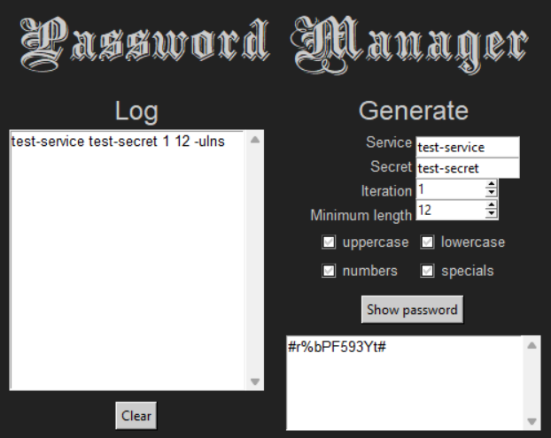

<div align="center">
    
</div>

Generates and manages passwords for different services closely conforming to length and character requirements.

## Command Line Interface

### Usage

To generate a password, four input arguments are required:
- `service` - the name of the site or service in which a password is being generated for (string)
- `secret` - a secret phrase or a base password (string)
- `iteration` - how many times this password was generated with the current `service` and `secret` (integer)
- `min_length` - the minimum length of the password to generate (integer)

Empty strings are permitted for `service` and `secret`.

At least one of the following options are also required:
- `-u, --upper` - include uppercase letters
- `-l, --lower` - include lowercase letters
- `-n, --number` - include numbers
- `-s, --special` - include special characters

Using the `-h, --help` option will display usage details.

```
python3 pm_cli.py [-h|--help] [-u|--upper] [-l|--lower] [-n|--number] [-s|--special] service secret iteration min_length
```

### Example

```
> python3 pm_cli.py test-service test-secret 1 12 -ulns
#r%bPF593Yt#
```

## Graphical User Interface

### Usage

On the right side, echoing the requirements for the [command line interface](#usage), there are four input boxes for the service, secret, iteration, and minimum length, as well as four checkboxes for character type options. Data for the input fields are filled with default arguments: empty strings for the service and secret, which are allowed, and the minimum allowed integer value (1) for the iteration and minimum length. At least one character type must be selected to generate a password.

On the left hand side lies the input log, which lists all unique input used to generate passwords (see [Logging](#logging)). The log can be cleared via the button underneath it.

### Example

<div align="center">
    
</div>

## Logging

Whenever a password is generated, the input that generated it is saved to a file named "log" which is accessible in the project's root directory. The file is automatically created if it does not exist when the program is run. This allows for reproducibility of generated passwords, as the passwords themselves are not saved.